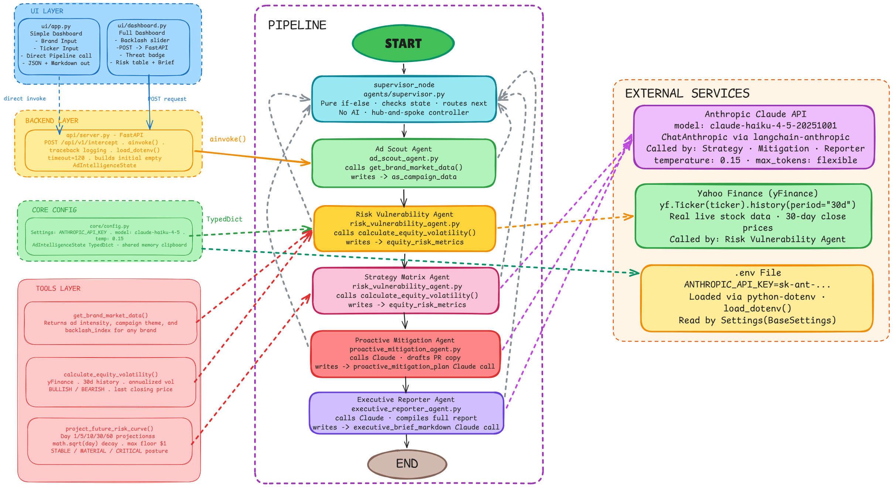

# Blackwatch
it's a multi-agent pipeline built with LangGraph, where five specialized AI agents work in sequence, each doing one job and passing their work through a shared memory object,

## 🎯 The Vision
In professional finance and PR, market intelligence is often delayed by manual data aggregation and fragmented analysis. **Blackwatch** replaces this manual bottleneck with an autonomous, multi-agent pipeline. It transforms raw brand and stock data into a comprehensive Risk Mitigation Report in seconds.

## 🏗️ Architectural Philosophy
I built Blackwatch using **LangGraph** to solve the "single-prompt" limitation. By isolating specific tasks—fetching, analysis, strategy, and reporting—into five specialized agents, the system achieves higher accuracy and provides a clear audit trail for every piece of information.

## 🤖 The Pipeline Workflow
1. **Ad Scout Agent:** Aggregates real-time market/ad signals.
2. **Risk Vulnerability Agent:** Pulls live ticker data and computes volatility metrics.
3. **Strategy Matrix Agent:** Leverages Claude to synthesize findings and assign a threat level.
4. **Proactive Mitigation Agent:** Generates defensive PR strategy for Elevated/Critical threats.
5. **Executive Reporter Agent:** Orchestrates final Markdown report generation.

**The Supervisor Logic:** At the core, a deterministic supervisor node manages the workflow, ensuring agents are routed efficiently based on the remaining task requirements, which minimizes API latency and costs.

## 🧠 Key Technical Decisions
* **Asynchronous Execution:** Implemented `ainvoke()` throughout the pipeline to prevent UI freezing during complex API calls.
* **Resilient State Management:** Used a central Pydantic schema for the shared memory object, ensuring type safety as data passes between agents.
* **Observability:** Integrated advanced traceback logging to convert generic failures into actionable debugging information.
* **Orchestration:** Chose LangGraph over standard chains to allow for cyclical agent workflows and granular state transitions.

## 🛠 Tech Stack
- **Frameworks:** LangGraph, FastAPI, Streamlit
- **LLM:** Anthropic Claude (via API)
- **Data:** Yahoo Finance API

## 🔮 Future Roadmap
- [ ] **Human-in-the-Loop:** Implementing a gatekeeper node for manual PR strategy approval.
- [ ] **Persistent Memory:** Migrating state to a persistent database for long-term intelligence tracking.
- [ ] **Real-time Alerting:** Integrating webhooks to trigger reports automatically based on market volatility spikes.

